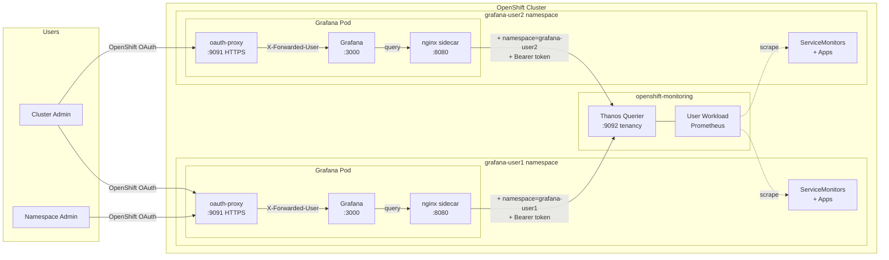
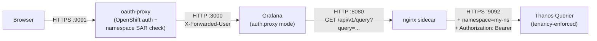

# Per-Namespace Grafana on OpenShift with Thanos 9092 Isolation

Deploy isolated Grafana instances on OpenShift -- one per namespace. Each instance can only query metrics from its own namespace, enforced by the Thanos tenancy endpoint (port 9092) and OpenShift RBAC. Users who are namespace admins get full Grafana admin on their instance.

## Architecture

### High-Level Overview



### Pod Internal Flow



### Three containers per Grafana pod

| Container | Port | Role |
|---|---|---|
| **oauth-proxy** | 9091 (HTTPS) | Authenticates users via OpenShift OAuth. Namespace-scoped SAR check ensures only users with access to the namespace can log in. |
| **grafana** | 3000 (HTTP) | Grafana application using `auth.proxy` to trust the `X-Forwarded-User` header from oauth-proxy. All authenticated users get Grafana `Admin` role. |
| **nginx sidecar** | 8080 (HTTP) | Injects `namespace=<ns>` query parameter and `Authorization: Bearer <SA-token>` header into every Prometheus request before forwarding to Thanos 9092. |

## Namespace Isolation

- The nginx sidecar hardcodes `namespace=<ns>` into every request to Thanos 9092
- The SA token used by nginx only has `edit` permissions in its own namespace
- Thanos 9092 performs a SubjectAccessReview to verify the SA can access the requested namespace
- Even if a user uploads a dashboard with a namespace variable or selector, all queries are forced through the nginx sidecar which always appends the fixed namespace
- Cross-namespace queries are rejected by Thanos with `403 Forbidden`

## Prerequisites

1. **OpenShift 4.x** with the Grafana Operator installed (e.g., from OperatorHub)
2. **User Workload Monitoring** enabled:
   ```yaml
   # In openshift-monitoring/cluster-monitoring-config ConfigMap:
   data:
     config.yaml: |
       enableUserWorkload: true
   ```
3. **oc** CLI logged in as a cluster-admin
4. **kustomize** (built into `oc` via `oc kustomize` or standalone `kustomize` CLI)

## Repository Structure

```
common/
  base/
    core/           # Grafana CR, datasource, CA bundle, session secret
    rbac/           # ClusterRole, ClusterRoleBindings, edit RoleBinding, SA token
    thanos-proxy/   # nginx ConfigMap with namespace injection template
overlays/
  grafana-user1/    # Overlay for the grafana-user1 namespace
  grafana-user2/    # Overlay for the grafana-user2 namespace
```

Base files use `NAMESPACE` as a placeholder. Each overlay replaces it with the actual namespace name via kustomize patches.

## Deploy a New Grafana Instance

### Step 1: Create the namespace

```bash
oc create namespace <my-namespace>
```

### Step 2: Create a new overlay

Copy an existing overlay and replace the namespace:

```bash
cp -r overlays/grafana-user1 overlays/<my-namespace>
```

Edit `overlays/<my-namespace>/kustomization.yaml`:
- Replace every occurrence of `grafana-user1` with `<my-namespace>`

### Step 3: Apply the overlay

```bash
oc apply -k overlays/<my-namespace>/
```

### Step 4: Wait for the Grafana Operator to reconcile

```bash
oc get grafana grafana -n <my-namespace> -w
```

Wait until `stageStatus` shows `success`.

### Step 5: Create the SA token secret

The SA token secret must be created after the Grafana Operator creates the `grafana-sa` service account:

```bash
oc apply -f common/base/rbac/ds-token-secret.yaml -n <my-namespace>
```

Wait a few seconds for the token to be populated, then re-sync the datasource:

```bash
oc delete grafanadatasource prometheus-thanos -n <my-namespace>
oc apply -k overlays/<my-namespace>/
```

### Step 6: Grant namespace admin to a user

```bash
oc adm policy add-role-to-user admin <username> -n <my-namespace>
```

The user can now log into Grafana via the route:

```bash
oc get route grafana-route -n <my-namespace> -o jsonpath='{.spec.host}'
```

## RBAC Summary

| Resource | Scope | Purpose |
|---|---|---|
| ClusterRole `grafana-oauth-proxy` | Cluster | Allows oauth-proxy to perform token reviews and SAR checks |
| ClusterRoleBinding `grafana-oauth-proxy-<ns>` | Cluster | Binds the ClusterRole to the namespace SA |
| ClusterRoleBinding `auth-delegator-<ns>` | Cluster | Allows SA to delegate authentication |
| RoleBinding `grafana-sa-edit` | Namespace | Grants SA `edit` permissions (required for Thanos 9092 tenancy check) |
| Secret `grafana-ds-token` | Namespace | Long-lived SA token used by the nginx sidecar for Thanos auth |

## How the Datasource Works

The Grafana datasource points to `http://localhost:8080` (the nginx sidecar in the same pod). It uses `httpMethod: GET` and has no authentication headers configured -- the nginx sidecar handles everything:

1. Grafana sends a Prometheus query to `http://localhost:8080/api/v1/query?query=up`
2. Nginx appends `&namespace=<ns>` to the query string
3. Nginx sets the `Authorization: Bearer <SA-token>` header (read from the mounted SA token at startup)
4. Nginx forwards the request to `https://thanos-querier.openshift-monitoring.svc.cluster.local:9092`
5. Thanos validates the token, checks the SA has access to the namespace, and returns only that namespace's metrics

## Cleanup

Remove a single instance:

```bash
oc delete -k overlays/<my-namespace>/
oc delete namespace <my-namespace>
```

Remove all cluster-scoped resources:

```bash
oc delete clusterrolebinding grafana-oauth-proxy-<ns> auth-delegator-<ns>
oc delete clusterrole grafana-oauth-proxy  # only if no other instances remain
```
